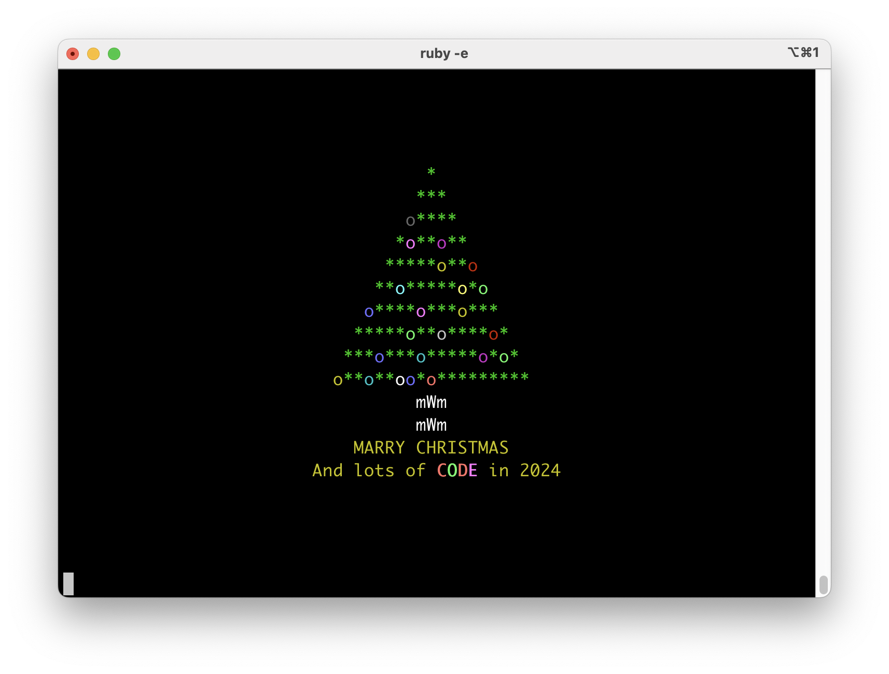

# ChristmasTree

christmas tree cli

# dependency

System dependencies:

- Ruby 3.0+
- Ncurses: macos: `brew install ncurses`

# local run

`ruby christmas_tree.rb`

`./christmas_tree.rb`

## add your name

`./christmas_tree.rb --name <your name>`

# remote run

## use GEM

`gem exec christmas_tree`

## use Curl

`ruby -e "$(curl -fsSL https://raw.githubusercontent.com/Mark24Code/christmas_tree/main/christmas_tree.rb)"`

### add your name

`ruby -e "$(curl -fsSL https://raw.githubusercontent.com/Mark24Code/christmas_tree/main/christmas_tree.rb)" -- -n <your name>`

# preview

